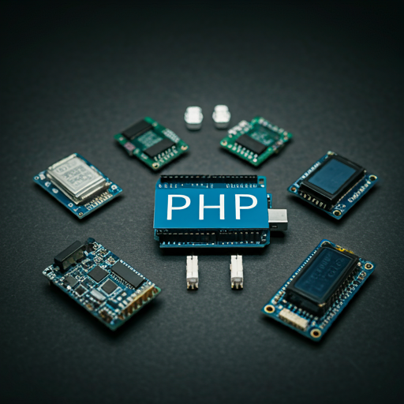

# What is PIOT?

PIOT is a framework support PHP Control mainboards as: `Arduino, Atmega2560, Esp32, Esp8266 ...etc`.

# How to use?

You can download this library after that upload to library of arduino library. Next step you need add this

   ```cpp
      #include <PIOT.h>
      PIOT piot;

      void setup() {
         Serial.begin(9600);
         piot.begin();
      }

      void loop() {
         piot.listen();
      }
   ```

# Don't forget

Don't forget close Arduino IDE after upload successfully. Because it can appear problem about permission while PHP connect.

# PHP

Visit here https://github.com/steveleetn91/php-PIOT

# Tiếng Việt 

Mình sẽ cố gắng thêm tiếng việt để người việt xem tiện hơn
